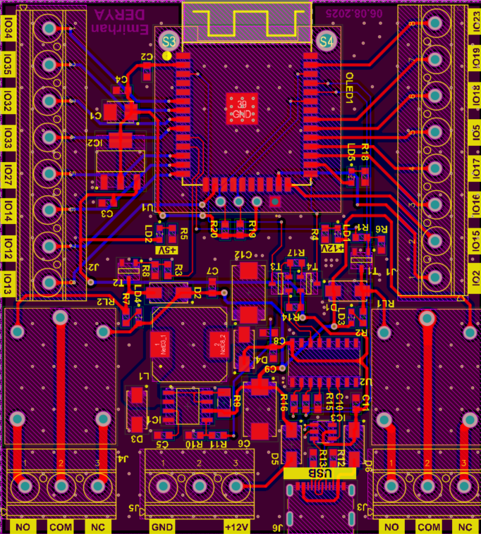
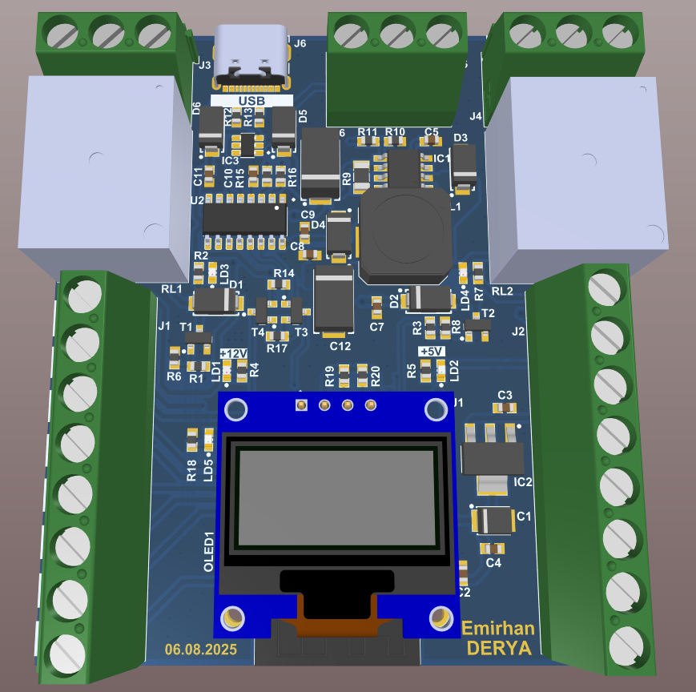
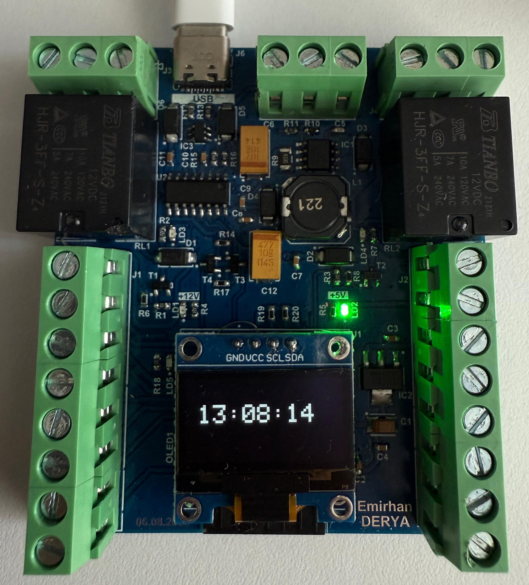

# ESP32-Based Custom PCB Design

This repository contains the custom schematics, PCB layout, and manufacturing files for an ESP32-based hardware project, designed entirely from scratch using Altium Designer.

## Board Preview

| 2D PCB Layout | 3D Render from Altium | Assembled PCB |
|:---:|:---:|:---:|
|  |  |  |

## Technical Specifications & Hardware Architecture

### Power Distribution & Management
* 12V DC input via secure industrial terminal blocks.
* High-efficiency switching regulator designed around the MC34063AD DC-DC Buck Converter for primary 12V to 5V regulation.
* An SPX1117-3.3 Low-Dropout (LDO) linear regulator for 5V to 3.3V logic power.
* ESD protection implemented on the USB data lines using a USBLC6 diode array.
* Standard flyback diodes placed across all 12V relay coils.
* 100nF and 100µF decoupling capacitors strategically placed.
* Strategic polygon pours for solid ground planes.

### Microcontroller & Peripherals
* Built around the ESP32-WROOM-32E module.
* Integrated CH340 chip handling the USB-to-UART bridge.
* A custom DTR/RTS auto-reset circuit utilizing BC817 NPN transistors.
* Mechanical 12V relays driven securely via BC817 NPN transistors.
* Dedicated I2C header connected to IO21 (SDA) and IO22 (SCL).

## Manufacturing Files
The repository includes all necessary production outputs in standard formats:
* Gerber files containing full fabrication layers.
* Bill of Materials (BOM) detailing the complete component list.
* NC Drill files providing precise drilling data.

## Schematic Document
The full logical circuit design can be reviewed here: [View Schematic PDF](ESP32_CustomBoard_Schematic.pdf)
